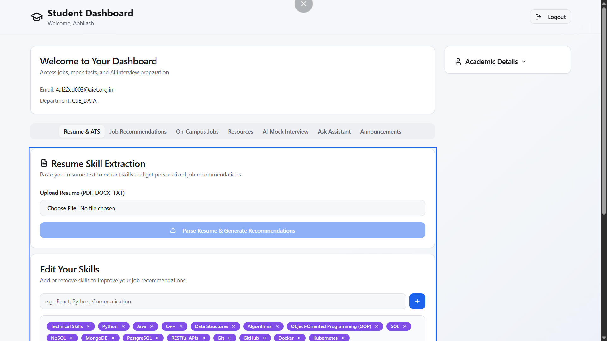
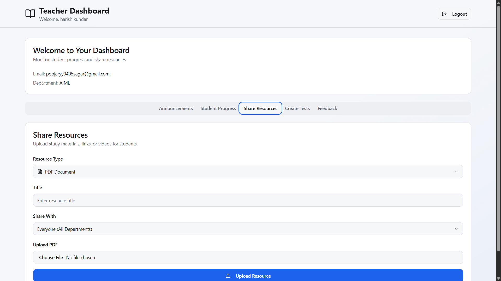
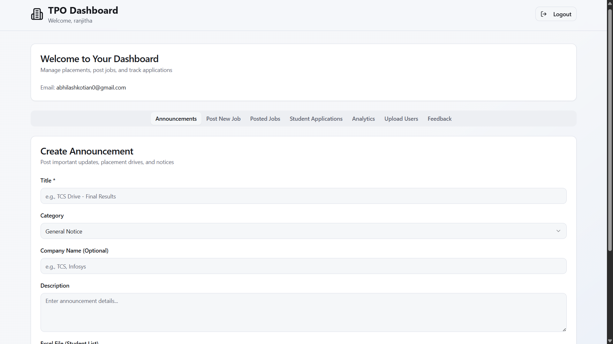

## 🚀 Placement Management System

A web-based application designed to streamline and automate the college placement process. The system connects Students, Teachers, and Training & Placement Officers (TPOs) in a centralized platform to manage job postings, applications, announcements, resumes, and student performance efficiently.

## 📌 Project Overview

The Placement Management System simplifies the traditional placement workflow by digitizing and organizing all placement-related activities. It improves transparency, reduces manual work, and enhances communication between stakeholders.

## 🎯 Problem Statement

Colleges often face challenges such as:

- Manual job posting and tracking

- Difficulty managing student applications

- Lack of centralized communication

- Limited visibility into student performance

- Unstructured interview preparation

This system solves these issues with a role-based, structured platform.

## 👥 User Roles

### 👨‍🎓 Student

- Create & update profile

- Upload resume

- View & apply for jobs

- Access announcements

- Participate in mock interviews

- View feedback

### 👩‍🏫 Teacher

- Post announcements

- Share resources

- Monitor student progress

- Conduct tests

### 🧑‍💼 TPO (Training & Placement Officer)

- Post & manage job listings

- View student applications

- Upload student data

- Access analytics dashboard

- Manage announcements

## 🛠️ Tech Stack

### Frontend:

- React (TypeScript)

- Vite

- Tailwind CSS

## Architecture:

- Component-Based Design

- Role-Based Access Control

- Dashboard-Oriented Navigation

## ⚙️ Core Modules

- Resume Upload System

- Job Posting & Application Management

- Student Dashboard

- Analytics Dashboard

- Announcement System

- Feedback System

- Mock Interview Interface

## 🚀 Key Features

- Centralized placement management

- Organized job application tracking

- Structured communication system

- Performance monitoring dashboard

- User-friendly interface

## 📊 Benefits

- Reduces manual administrative work

- Improves placement transparency

- Enhances student preparedness

- Efficient data organization

- Better decision-making with analytics

## 🔮 Future Enhancements

- Backend database integration

- Email & notification system

- Advanced analytics dashboard

- Resume screening with AI

- Recruiter portal integration
